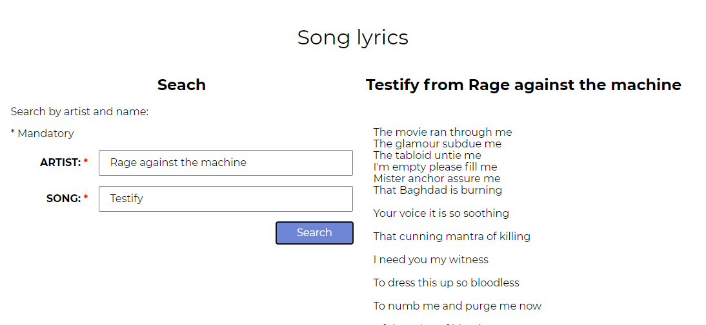

# Search song

This project allows the user to search the lyrics of an specific song. For doing that, they need to fill a form with the name of the artist, and the song.

For searching the lyrics an external [API](https://lyricsovh.docs.apiary.io/#reference/0/lyrics-of-a-song/search) is used with fetch() to get the lyrics. If the song doesn't exists, an error is shown to the user. Otherwise, the lyrics are shown.

